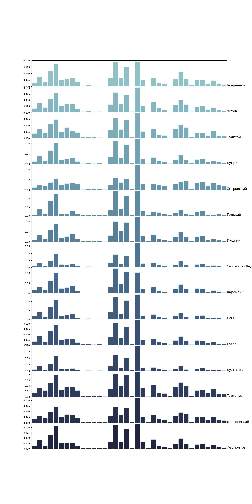

### N-граммы
Для отражения стиля автора необходимо отделить стилистику написания текста от его содержания.
N-граммы, состоящие из частей речи, позволяют очистить текст от содержания, но в то же время сохранить стиль автора,
выражающийся в предпочтении определенных сочетаний частей речи.
Для определения частей речи используется библиотека mystem. Выделяются следующие части речи:
* A: прилагательное
* ADV: наречие
* ADVPRO: местоименное наречие
* ANUM: числительное-прилагательное
* APRO: местоименное прилагательное
* COM: часть составного слова
* INTJ: междометие
* NUM: числительное
* PART: частица
* S: существительное
* SPRO: местоимение
* V: глагол

Текст, очищенный от знаков препинания и прочих частей речи (союзы, предлоги), разбивается на n-граммы.
Затем строится гистограмма всех комбинаций частей речи, и очищается от заведомо вырожденных комбинаций частей речи 
( т.е. таких, которые не встречаются в текстах авторов). Предварительно была выбрана модель 3-грамм,
как балансирующая вычислительную сложность и позволяющую извлечь стиль автора.
гистограмму можно увидеть ниже:

Можно заметить, что распределения многих авторов похожи, как так основные комбинации частей речи используются всеми,
однако заметны небольшие различия в распределениях. Например, распределение n-грамм Горького, Булгакова и Салтыкова-Щедрина отражает меньшее разнообразие комбинаций частей речи,
и более частую "повторяемость" одних и тех же сочетаний. В то же время Островский использует чаще использует разнообразные комбинации частей речи.
