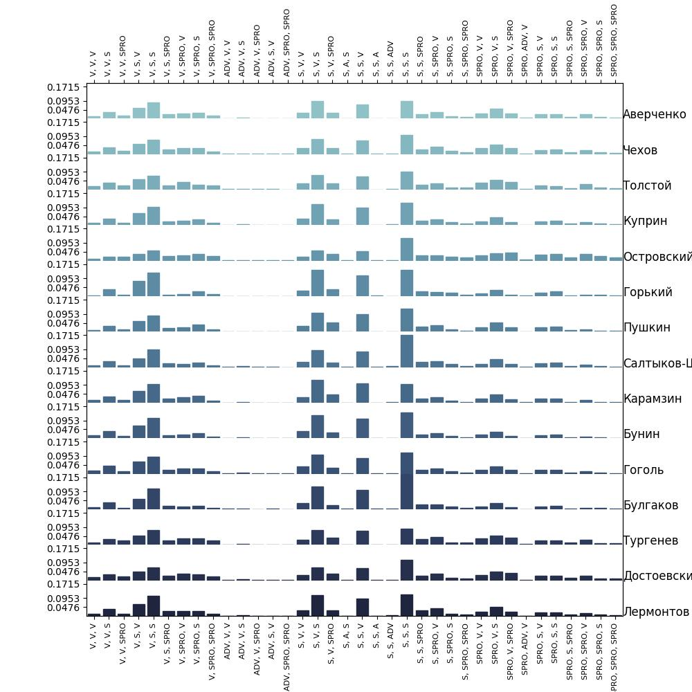

# Разведочный Анализ Данных Для Определения Авторства Текстов

Мы проанализировали распределения следующих признаков:

* Плотность запятых (Comma Density)
* Плотность диалогов (Dialogue Density)
* Плотность восклицательных предложений (Exclamation Density)
* Плотность вопросительных предложений (Question Density)
* Средняя длина слов (Word Average Length)
* Средняя длина предложений (Words Per Sentence)
* Распределение n-грамм (в терминах последоавтельностей частей речи)

Для всех признаков, кроме n-грамм, текст разрезался на батчи (наиболее подоходящие для признака),
и по каждому батчу проводился подсчет.

## Плотность запятых

Батчи: наборы по 2000 токенов (полученных с помощью библиотеки nltk).

Единицы измерения: (кол-во запятых) / (кол-во токенов).

Этот признак качественно не отличается для разных писателей, однако все равно можно заметить, 
что Булгаков, Пушкин и Карамзин, например, пренебрегали запятыми в сравнении с Буниным.
При этом у Пушкина более явно выраженные выбросы, чем у других писателей

## Плотность диалогов

Батчи: хочется считать, какую долю текста занимают диалоги, однако просто нарезать текст на куски
из одинакового количества символов - плохая идея, так как так можно расщепить реплику. Поэтому
текст нарезался на батчи из целого числа параграфов так, чтобы в каждом батче было немногим больше
50000 символов.

Единицы измерения: (кол-во символов диалога) / (кол-во символов в тексте).

Тут, пожалуй, стоит выделить Достоевского, у которого распределение плотности диалогов почти равномерное от 0 до 0.7.
Также очень много диалогов в тексте можно найти у Аверченко, который является, наверное, единственным писаталем со средним больше 0.5
для этого признака. Весьма компромиссное положение у Горького. Лермонтов, Пушкин и Толстой, видимо, уделяли больше внимания повествованию.

## Плотность восклицательных предложений

Батчи: наборы по 100 предложений.

Единицы измерения: доля восклицательных предложений.

Самым экспрессивным оказался Салтыков-Щедрин, а самыми спокойными - Пушкин и Толстой. Также опредленное присутствие длинных выразительных кусков текста есть у Лермонтова. В целом писатели достаточно умеренно использовали восклицания.

## Плотность вопросительных предложений

Батчи: наборы по 100 предложений.

Единицы измерения: доля вопросительных предложений.

Чаще всех вопросы задавл Аверченко. В целом все писатели не злоупотребляли вопросительными конструкциями, а у Пушкина их вообще немного: мода для него приходится на полное отсутствие вопросительных знаков.

**Примечание:** может показаться странным, что у Пушкина меньше восклицаний, вопросов и диалогов в сравнении с другими писателями. Связано это скорее всего с тем, что у Пушкина много работ, посвященных актуальным в то время событиям и историческим обзорам.

## Средняя длина предложений

Батчи: наборы по 100 предложений.

Единицы измерения: (кол-во слов) / (кол-во предложений).

Из интересного можно отметить, что моды распределений для Чехова, Островского и Булгакова приходятся на короткие предложения. Также весьма примечатльно, что у Пушкина есть более выроженные выбросы в виде очень длинных предложений.

## Средняя длина слова

Батчи: наборы по 100 предложений.

Единицы измерения: длина слов в символах.

Средняя длина слова косвенно указывает на предпочтения авторов к более простым словам и фразам,
или к более "цвестастым" выражениям и сложным словам. 
Заметно, что это характеристика не очень репрезентативна-высокая дисперсия признака заметна у всех авторов. 
Но можно отметить, что Чехов и Лермонтов предпочитают более короткие слова. 

## N-граммы

Батчи: наборы по 100 предложений.

Единицы измерения: вероятность n-граммы из частей речи.

Для отражения стиля автора необходимо отделить стилистику написания текста от его содержания.
N-граммы, состоящие из частей речи, позволяют очистить текст от содержания, но в то же время сохранить стиль автора,
выражающийся в предпочтении определенных сочетаний частей речи.
Для морфологического анализа и построения n-грам используется библиотека mystem.
Выделяются следующие части речи:
* A: прилагательное
* ADV: наречие
* ADVPRO: местоименное наречие
* ANUM: числительное-прилагательное
* APRO: местоименное прилагательное
* COM: часть составного слова
* INTJ: междометие
* NUM: числительное
* PART: частица
* S: существительное
* SPRO: местоимение
* V: глагол

Текст, очищенный от знаков препинания и прочих частей речи (союзы, предлоги), разбивается на n-граммы.
Затем строится гистограмма всех возможных n-грамм, полученных комбинациями частей речи из списка. Далее текст очищается от заведомо вырожденных комбинаций частей речи 
( т.е. таких, которые не встречаются в текстах авторов). Предварительно была выбрана модель 3-грамм,
как балансирующая вычислительную сложность и позволяющая извлечь стиль автора.\
гистограмму можно увидеть ниже:

Можно заметить, что распределения многих авторов похожи, как так основные комбинации частей речи используются всеми,
однако заметны небольшие различия в распределениях. Например, распределение n-грамм Горького, Булгакова и Салтыкова-Щедрина отражает меньшее разнообразие комбинаций частей речи и более частую "повторяемость" одних и тех же сочетаний. 
В то же время Островский использует чаще использует разнообразные комбинации частей речи.
