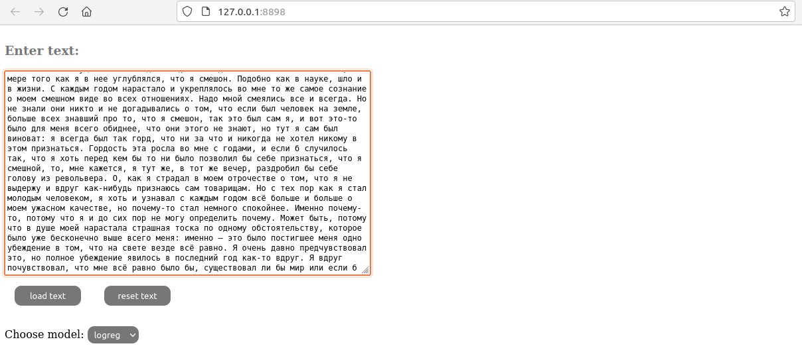
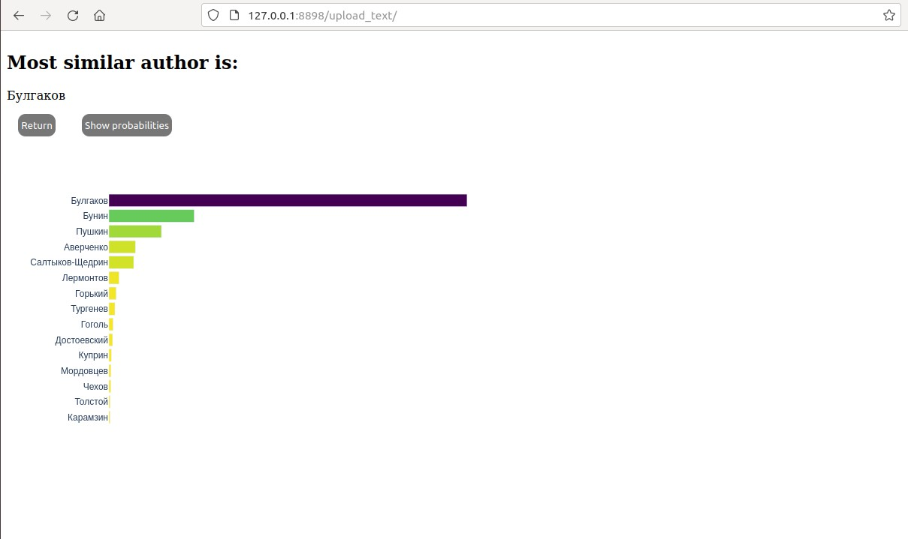
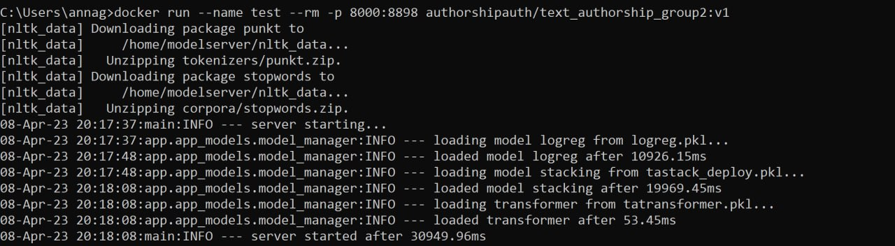
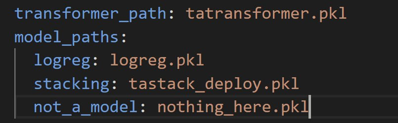
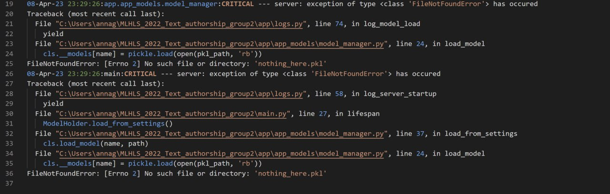

## Описание работы сервиса
Сервис представлен веб-интерфейсом, который позволяет взять произвольный отрывок текста и предсказать,
к какому из авторов (из сформированного датасета) ближе по стилю отывок.
При GET-запросу к сервису в ответ мы получаем форму, содержание которой будет 
отправлено POST-запросом к серверу. Также на странице можно выбрать, какая из доступных моделей будет использоваться для предсказания.
Текстиз формы будет далее преобразован в формат, используемый предобученной моделью,
и отправлен на классификацию.

После обработки запроса пользователь перенаправляется на страницу результатов,
где представлен наиболее вероятный автор отрвывка и распределение близости отрывка по стилю ко всем авторам,
знакомым модели.

Сервис представляет собой сервер FastAPI, обрабатывающий запросы пользователей.
В процессе инициализации сервера загружаются сохраненные ранее в формате pickle ML-модели.
Лог инициализации можно увидеть ниже:

Помимо функционала классификации в сервис добавлена возможность логирования запросов.
Каждом запросу в процессе обработки middleware добавляет уникальный uuid, который затем можно отследить в логах.
Для конфигурации проекта используется YAML-файл config.yml, который содержит список моделей и настройки логирования.
Логи отслеживают нештатную работу сервиса и время,затраченное на обработку запросов.
Есть возможность указать логфайл для записи, по умолчанию логи выводятся в standard output.
Как пример, можно рассмотреть ситуацию с добавлением в конфигурацию отсутствующей модели:

В таком случае лог сохраняет уровень ошибки(критический) и стек вызова

